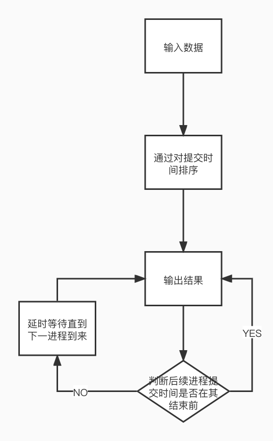
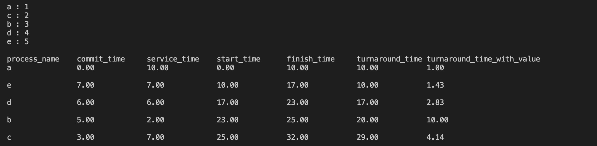

# 实验1 进程调度

## 实验目的

通过对进程调度算法的模拟，进一步理解进程的基本概念，加深对进程运行状态和进程调度过程、调度 算法的理解。

## 实验内容

* 实现一个进程模拟程序,对N个进程采用某种调用算法进行调度模拟。
* 了清楚地观察每个进程的调度过程，程序应将每个进程的被调度情况显示出来。
* 分析程序运行的结果

## 设计实现

以FCFS算法为例：



## 源代码

```clike
#include <iostream>
#include <cstdio>
#include <algorithm>
using namespace std;
struct f{
    char name[64];
    float commit;
    float runtime;
    float finish;
    float start;
    float turnaround;
    float turnaround_values;
    float response;
    float wait;
    int priority;
    f(): name("*"),commit(0),runtime(0),finish(0),start(0), \ 
    turnaround(0),turnaround_values(0),response(0),priority(0) {}
};
struct f f[100000];
int n;
bool cmp(const struct f a, const struct f b){
    return a.commit<b.commit;
}
// bool cmpSJF(const struct f a,const struct f b){
//     return a.commit<b.commit || (a.commit==b.commit && a.runtime < b.runtime);
// }
void FCFS(){
   sort(f,f+n,cmp);
    for(int i = 0;i<n;i++){
        if (i==0){
            f[i].start = f[i].commit;
            f[i].finish = f[i].commit+f[i].runtime;
        }
        else{
            if(f[i].commit > f[i-1].finish){
                f[i].start = f[i].commit;
            }
            else{
                f[i].start = f[i-1].finish;
            }
            f[i].finish = f[i].start + f[i].runtime;
        }
        f[i].turnaround = f[i].finish - f[i].commit;
        f[i].turnaround_values = f[i].turnaround / f[i].runtime;
    }
    printf("\nprocess_name\tcommit_time\tservice_time\t \
    start_time\tfinish_time\tturnaround_time\tturnaround_time_with_value\n");
    for(int i=0;i<n;i++){
        printf("%s\t\t%-.2f\t\t%-.2f\t\t%-.2f\t\t%-.2f\t\t \ 
        %-.2f\t\t%-.2f\t\t\n\n", \ 
        f[i].name,f[i].commit,f[i].runtime,f[i].start,f[i].finish, \
        f[i].turnaround,f[i].turnaround_values);
    } 
    return;
}
void SJF()
{
    sort(f,f+n,cmp);
    for(int i = 0;i<n;i++){
        if (i==0){
            f[i].start = f[i].commit;
            f[i].finish = f[i].commit+f[i].runtime;
        }
        else{
            for(int j=i; f[j].commit <= f[i-1].finish && j<n; j++){
                for(int k = j; f[k].commit <= f[i-1].finish && k<n; k++){
                    if(f[j].runtime > f[k].runtime){
                        swap<struct f>(f[j],f[k]);
                    }
                }
            }
            //printf("%s\n",f[i].name); 
            if(f[i].commit > f[i-1].finish){
                f[i].start = f[i].commit;
            }
            else{
                f[i].start = f[i-1].finish;
            }
            f[i].finish = f[i].start + f[i].runtime;
        }
        f[i].turnaround = f[i].finish - f[i].commit;
        f[i].turnaround_values = f[i].turnaround / f[i].runtime;
    }
    printf("\nprocess_name\tcommit_time\tservice_time\tstart_time\t \ 
    finish_time\tturnaround_time\tturnaround_time_with_value\n");
    for(int i=0;i<n;i++){
        printf("%s\t\t%-.2f\t\t%-.2f\t\t%-.2f\t\t%-.2f\t\t%-.2f\t\t \ 
        %-.2f\t\t\n\n", \ 
        f[i].name,f[i].commit,f[i].runtime,f[i].start, \ 
        f[i].finish,f[i].turnaround,f[i].turnaround_values);
    }
    return ;
}

void HRRN()
{
    sort(f,f+n,cmp);
    for(int i = 0;i<n;i++){
        if (i==0){
            f[i].start = f[i].commit;
            f[i].finish = f[i].commit+f[i].runtime;
        }
        else{
            for(int j=i; f[j].commit <= f[i-1].finish && j<n; j++){
                for(int k = j; f[k].commit <= f[i-1].finish && k<n; k++){
                    if(f[j].response < f[k].response){
                        swap<struct f>(f[j],f[k]);
                    }
                }
            }
            //printf("%s\n",f[i].name); 
            if(f[i].commit > f[i-1].finish){
                f[i].start = f[i].commit;
            }
            else{
                f[i].start = f[i-1].finish;
            }
            f[i].finish = f[i].start + f[i].runtime;
        }
        for(int j = i+1; j<n && f[j].commit <= f[i].finish; j++){
            f[j].wait = f[i].finish - f[j].commit;
            f[j].response = (f[j].wait + f[j].runtime) / f[j].runtime; 
            //printf("%s %.3f\n",f[j].name,f[j].response);
        }
        f[i].turnaround = f[i].finish - f[i].commit;
        f[i].turnaround_values = f[i].turnaround / f[i].runtime;
    }
    printf("\nprocess_name\tcommit_time\tservice_time\tstart_time\t \ 
    finish_time\tturnaround_time\tturnaround_time_with_value\n");
    for(int i=0;i<n;i++){
        printf("%s\t\t%-.2f\t\t%-.2f\t\t%-.2f\t\t%-.2f\t\t%-.2f\t\t \ 
        %-.2f\t\t\n\n", \ 
        f[i].name,f[i].commit,f[i].runtime,f[i].start, \ 
        f[i].finish,f[i].turnaround,f[i].turnaround_values);
    }
    return;
}

void HPF(){
    sort(f,f+n,cmp);
    for(int i = 0; i<n; i++){
        printf("%s : ",f[i].name);
        scanf("%d",&f[i].priority);
    }
    for(int i = 0;i<n;i++){
        if (i==0){
            f[i].start = f[i].commit;
            f[i].finish = f[i].commit+f[i].runtime;
        }
        else{
            for(int j=i; f[j].commit <= f[i-1].finish && j<n; j++){
                for(int k = j; f[k].commit <= f[i-1].finish && k<n; k++){
                    if(f[j].priority < f[k].priority){
                        swap<struct f>(f[j],f[k]);
                    }
                }
            }
            //printf("%s\n",f[i].name); 
            if(f[i].commit > f[i-1].finish){
                f[i].start = f[i].commit;
            }
            else{
                f[i].start = f[i-1].finish;
            }
            f[i].finish = f[i].start + f[i].runtime;
        }
        f[i].turnaround = f[i].finish - f[i].commit;
        f[i].turnaround_values = f[i].turnaround / f[i].runtime;
    }
    printf("\nprocess_name\tcommit_time\tservice_time\tstart_time\t \ 
    finish_time\tturnaround_time\tturnaround_time_with_value\n");
    for(int i=0;i<n;i++){
        printf("%s\t\t%-.2f\t\t%-.2f\t\t%-.2f\t\t%-.2f\t\t%-.2f\t\t \ 
        %-.2f\t\t\n\n", \ 
        f[i].name,f[i].commit,f[i].runtime,f[i].start, \ 
        f[i].finish,f[i].turnaround,f[i].turnaround_values);
    }
    return;
}
int main()
{
    
    cin>>n;
    for(int i = 0;i<n;i++){
        cout<<"process_name,commit_time,runtime：";
        cin>>f[i].name>>f[i].commit>>f[i].runtime;
    }
    FCFS();
    SJF();
    HRRN();
    HPF();
    return 0;
}
```

## 实验结果

.png>)



## 实验分析

此实验中一共实现了4个算法：

* 先来先服务算法（FCFS）
* 最短作业算法（SJF）&#x20;
* 高响应比优先算法（HRRN）&#x20;
* 优先级调度算法（HPF）&#x20;

考虑到以上算法实际上在不考虑到抢占的情况下几乎是同样的， 所以，在实现中最大的区别在于将对应的参数进行排序， 参考到上述算法特性：&#x20;

* FCFS：针对进程提交时间进行排序&#x20;
* SJF：通过计算进程运行所需要的时间再排序&#x20;
* HRRN：在进程运行时，实时计算未运行进程等待时间后计算响应比，在上一进程运行结束后，对此时响应比排序&#x20;
* HPF：此算法需要额外考虑进程是否提交，在都提交后且未运行才进入排序

从算法实现的角度来看，4个算法的实现都很简单，最大的难点在于：&#x20;

1. 从细节考虑到可能存在空闲状态，即：上一进程运行结束后却无后续进程提交&#x20;
2. 对运算符重载
