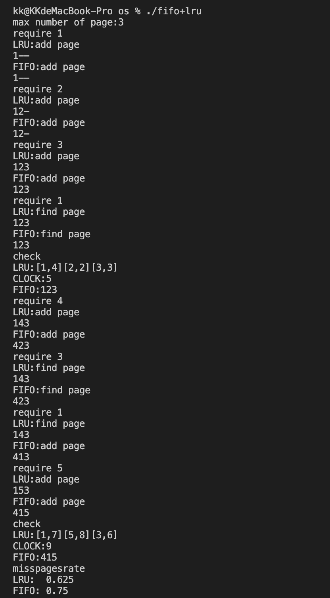

# 实验2 存储管理

## 实验目的

通过编写程序实现请求分页存储管理的Optimal、FIFO、LRU等页面置换算法中的一种，掌握虚拟存储管理中有关缺页处理方法等内容，巩固有关虚拟存储管理的教学内容。&#x20;

理解内存分配原理，特别是以页面为单位的虚拟内存分配方法。

## 实验内容

通过简单的程序模拟两种存储管理算法，通过输入页面访问序列，查页表等操作判别是否缺页，按照某 种算法淘汰页面，并调入所访问的页面，打印输入结果。

## 设计实现

输入使用简单命令行形式，check命令输出当前的页面，quit退出，require请求一个新页面（跟随一个字符作为参数），misspagesrate命令输出缺页率。缺页率在require指令执行中统计就可以了。下图分别为FIFO和LRU流程图：

.png>)

.png>)

## 源代码

```clike
#include <iostream>
#include <string>
#include <vector>
#include <stddef.h>
using namespace std;

struct page{
    char id;
    int vis;
    page() : id('-'), vis(0){}
    page(char id , int vis) : id(id),vis(vis){} 
};

struct fifo{
    size_t cntpos;
    size_t size;
    vector<page> p;
    fifo(size_t n):p(n),cntpos(0),size(n){}
    size_t require(char id, bool& loss){
        loss = false;
        size_t len = this->p.size();
        for(size_t i = 0; i<len;i++){
            if (this->p[i].id == id ){
                return i;
            }
        }
        loss = true;
        size_t pos = cntpos;
        this->p[this->cntpos].id = id;
        this->cntpos++;
        this->cntpos%=this->size;
        return pos;
    }

};

struct lru {
    vector<page> p;
    size_t cnttime;
    lru(size_t n): p(n), cnttime(1) { }
    size_t require(char id, bool& loss) {
        loss = false;
        size_t len = this->p.size();
        size_t ipos;
        int min = 0x7fffffff;
        for (size_t i = 0; i < len; i++) {
            if (this->p[i].id == id) {
                this->p[i].vis = this->cnttime;
                return i;
            }
            if (min > this->p[i].vis) {
                min = this->p[i].vis;
                ipos = i;
            }
        }
        loss = true;
        this->p[ipos].vis = this->cnttime;
        this->p[ipos].id = id;
        return ipos;
    }
    void clock() { ++this->cnttime; }
};

int main(){
    cout<<"max number of page:";
    int n;
    cin>>n;
    struct fifo fifo(n);
    struct lru lru(n);
    bool loss1, loss2;
    size_t num=0, _loss1=0, _loss2=0;
    string ins;
    while(1){
        char c;
        cin >> ins;
        if (ins == "quit"){
            break;
        }
        else if (ins == "require"){
            cin>>c;
            lru.require(c,loss1);
            lru.clock();
            cout<<"LRU:"<<(loss1 ?"add page":"find page")<<endl;
            for(page p:lru.p){
                cout<<p.id;
            }
            cout<<endl;
            fifo.require(c,loss2);
            cout<<"FIFO:"<<(loss2 ? "add page": "find page")<<endl;
            for(page p:fifo.p){
                cout<<p.id;
            }
            cout<<endl;
            if(loss1) _loss1++;
            if(loss2) _loss2++;
            num++;
        }
        else if(ins == "check"){
            cout<<"LRU:";
            for(page p:lru.p){
                cout<<'['<<p.id<<','<<p.vis<<']';
            }
            cout<<endl;
            cout<<"CLOCK:"<<lru.cnttime<<endl;
            cout<<"FIFO:";
            for(page p:fifo.p){
                cout<<p.id;
            }
            cout<<endl;
        }
        else if(ins == "misspagesrate"){
            cout << "LRU:  " << (double)_loss1 / num << endl;
            cout << "FIFO: " << (double)_loss2 / num << endl;
        }
    }
    return 0;
}
```

## 实验结果



## 实验分析

实验本身依旧比较简单，主要难度在于实现FIFO和LRU两算法的区别

* FIFO：是一种传统的按序执行方法，先进入的指令先完成并引退，跟着才执行第二条指令
* LRU：即最近最少使用，是一种常用的页面置换算法，选择最近最久未使用的页面予以淘汰。

根据以上概念可以分析得处难点在于：

* FIFO：实时保证指针更新在最新位置
* LRU：每次查询语句后将指针置于最旧位置

由于此实验更多在于概念上，所以细节并无难点
