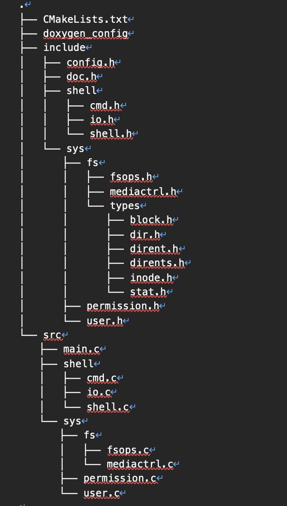

# 实验3 文件管理

## 实验目的

编写一个简单的二级文件系统实现程序，加深对文件系统的内部功能和内部实现的理解

## 实验内容

编写一个简单的文件系统，可以创建用户、用户登录、用户查询、删除用户、创建文件、删除文件、读写文件（随机读写）、截断文件，至少实现二级用户目录。

主要功能和行为包括：

* 用户：创建，登录，查询
* 文件：创建，删除，读写，查找，硬链接，支持多级目录
* 文件操作接口均考虑了操作权限。

### 技术方案概览：

* 系统环境：跨平台，已在Mac（Darwin KKdeMacBook-Pro.local 20.6.0 Darwin Kernel Version 20.6.0: Wed Jun 23 00:26:31 PDT 2021; root:xnu-7195.141.2\~5/RELEASE\_X86\_64 x86\_64）和Windows 10家庭版（21H1,19043.1348, Windows Feature Experience Pack 120.2212.3920.0）平台测试。下文所述版本号为“Mac上的已测试版本号/Win10上的已测试版本号”格式。
* 语言：C语言，CMake，doxygen
* 开发环境：VSCode 1.62.2
* 已测试的工具版本：
  * CMake：3.19.4/3.20.1
  * GNU make：3.81（仅Mac）
  * Nmake和Cl工具集：14.27.29112.0版本可执行文件，14.27.29110版本支持库，Windows SDK 10.0.18362.0版本（仅Win10）
  * doxygen：1.9.1/1.9.2（后者为自行编译版本）
  * clang：Apple clang version 13.0.0 (clang-1300.0.29.3)（仅Mac）
  * pdflatex：MiKTeX-pdfTeX 4.0.1 (MiKTeX 20.6.29)（细节省略。仅Win10，Mac上存在字体缺失，不能正确生成文档）
  * texworks：0.6.5 (MiKTeX 20.6.29) \[r.649699a0, 2020/3/26 2:49]（仅Win10，Mac上未能正确生成文档）

### 程序构建流程：

* 新建build目录，切换工作目录至其中（CMake脚本禁止源码树内构建）
* CMake <源码目录>（如果是Win10下，还需要选项-G'NMake Makefiles'），或者使用CMake-GUI工具
* 执行make（Mac下）或nmake（Win10下）
* 需要准备好passwd密码信息才能开始测试！

文档构建流程：

* 将工作目录切换到源码目录
* doxygen ./doxygen\_config（后者是写好的配置文件）。此时HTML文档已经完成，还需要构建LaTeX文档
* 使用texworks编译doc/latex/refman.tex
* 生成的doc/html/index.html和doc/html/refman.pdf即是最终文档

### 技术方案细节

1. 总体架构概览

本节展示总体架构中值得终端用户关注的细节，和一些大致的架构考虑。代码总体上采用K\&R风格。

该技术方案下仅有config.h存在配置用的宏。

表格 1 配置宏一览

| 标识符                   | 默认值 | 备注              |
| --------------------- | --- | --------------- |
| BLOCK\_SIZE           | 512 | 指定块尺寸，必须是2的幂。   |
| BLOCK\_NUM            | 512 | 块的总数，必须是正数。     |
| INDIRECT\_IDX\_1\_NUM | 10  | 直接索引数量。目前必须是10。 |
| MAX\_DIRLIST          | 20  | dir结构的参数。       |

类型设计高度参照linux设计。

表格 2 类型一览

| 类型                        | 备注                        |
| ------------------------- | ------------------------- |
| struct stat/stat\_t       | 描述文件状态。                   |
| struct inode/inode\_t     | 具有直接索引、一级索引和stat\_t       |
| struct dir/dir\_t         | 记录目录名称和所包含的项目（dirent\_t）。 |
| struct dirent/dirent\_t   | 记录inode\_t和项目名称的映射。       |
| struct dirents/dirents\_t | 包含dirent\_t的列表。           |
| union block/block\_t      | 四种块：数据块、目录块、索引块、dirents块。 |
| struct user/user\_t       | 描述用户记录。                   |

文档和翻译单元按模块划分。

>)

1. 块管理

该项目中，块管理使用位图式管理，定义在mediactrl文件中。块的位图存储于blk\_flag全局数组，0号块对应blk\_flag\[0]的LSB 0，1号块对应blk\_flag\[1]的LSB 1，CHAR\_BIT号块对应blk\_flag\[1]的LSB 0，依次类推，即n号块对应blk\_flag\[n / CHAR\_BIT]的LSB (n % CHAR\_BIT)。对应位为1表示对应块不可用，否则表示可用。

1. 块类型

该项目中，块分为数据块、目录块、索引块、dirents块四种。

其中，数据块没有任何特殊性，占有BLOCK\_SIZE字节。目录块是占有一个dir\_t结构的块，叙述目录的结构。索引块是一级索引指向的块，持有BLOCK\_SIZE / sizeof(int)个直接索引。dirents块未使用。

下文中将会详细叙述文件目录的结构，并给出示意图。

1. 目录管理

该FS中的目录管理完全由dir\_t结构完成。dir\_t结构包含了dirent\_t实例，以详细描述inode和文件入口的映射。

1. 用户操作

该设计中每个用户仅有一个属组。在执行登录时，会逐行检查（外部系统）工作目录下的passwd文件，检查用户是否存在，并比对密码。添加用户时，则进行对文件的写入。

用户登录后，用户信息被存入user\_t结构，有权限要求的文件系统api会要求调用者传递该实例的指针user，并以user的身份尝试执行操作。

1. 行为逻辑

整个系统的行为逻辑总体而言非常简单易懂，抽象层次较少，绝大多数算法都是线性遍历，没有实现特殊的索引结构。我们以例子来深入理解该系统的具体行为逻辑设计。

首先非常重要的一点是，由于一开始的设计缺陷，该系统不识别任何绝对路径，因此也不对目录名进行任何限制（可以包含斜杠）。Pwd指令给出的结果也是具有二义性的，不能作为绝对参照。

以图 2为例，0号块总是根目录，存在/src/hello.c这一文件。根目录的唯一目录块在0号块，/src的inode编号为2，/src唯一目录块在3号块，4号inode在src目录下持有文件hello.c。我们叙述从0开始写入后读取该文件的过程。

起初，整个系统只初始化一个根目录，并为其创建当前目录和父目录两项值（父目录的值是一个无意义值）。执行mkdir src，此时文件系统会以work\_dir为当前工作目录的inode（初始是0）逐个扫描所有直接索引指向的目录块，检查是否有名为src的dirent记录，若有，创建失败。若没有，文件系统执行creat\_ino，从0号块开始逐个扫描所有inode，如果找到未占用的inode，则会将这个inode作为新项目的inode。没有可用inode则会报告错误。然后，系统调用acq\_blk（acquire block）申请块，如果找到可用块，则作为该目录项的第一个目录块，并为其初始化“.”和“..”两项。

写入文件前需要显式创建文件，通过creat指令（类似于touch指令，但不会更新文件状态）。系统在当前work\_dir下查找文件是否存在，不存在则调用creat\_ino获取一个新的inode。creat调用在获取inode后会立即分配一个新块，无论文件类型是什么。

写入指定文件，除了文件名外还需要2个参数：起始偏移和写入长度，然后通过额外的交互输入写入内容，超出写入长度的部分被废弃，不足的部分不会进行特殊处理。

读出文件时则指定文件名、起始偏移和长度，但不会检查读出长度是否在文件长度范围内。

## 源代码

文件结构如下：

因代码过长，且因工程需要代码分为多个文件夹，故详细代码参考：

[https://github.com/whiteicey/file\_syetem](https://github.com/whiteicey/file\_syetem)

## 实验结果

.png>)

## 实验分析

主要问题在于初始架构不清晰，存在部分设计缺陷如：

1. 代码耦合度过高，最后难以对代码进行抽象分析
2. 架构很粗糙，并未在一开始考虑到文件名下划线，所以不能实现绝对路径下的cd ls指令
3. 文件删除并非通过删除指针而是通过memset对数据进行清除

以及因为时间和技术水平问题尚未实现功能：

1. 密码加密读取
2. 按“上箭头”读取历史指令

## 详细文档附录


